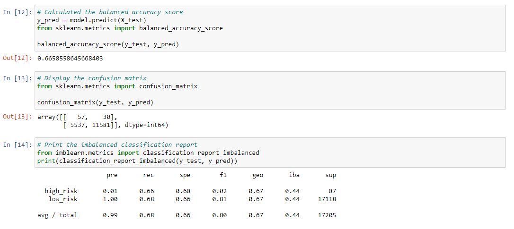
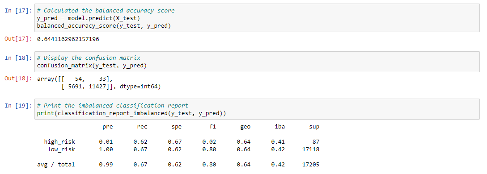
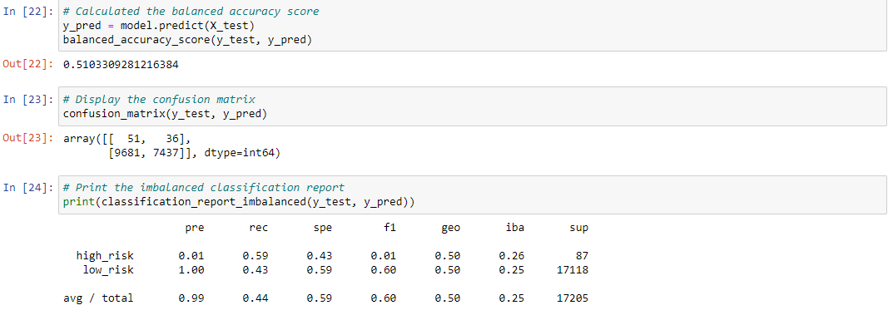
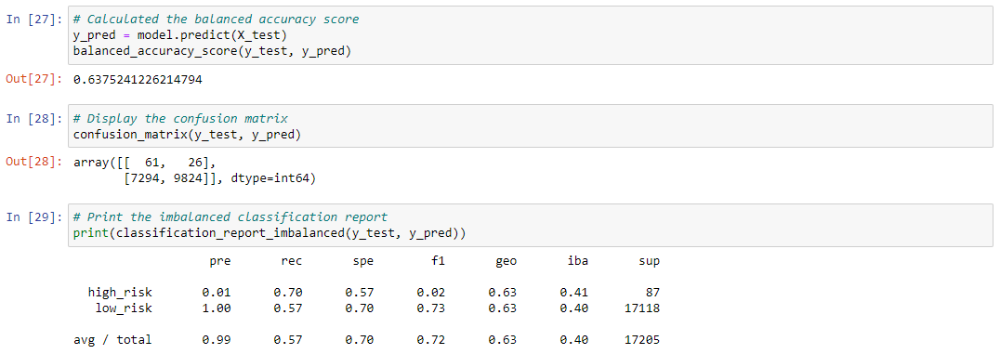
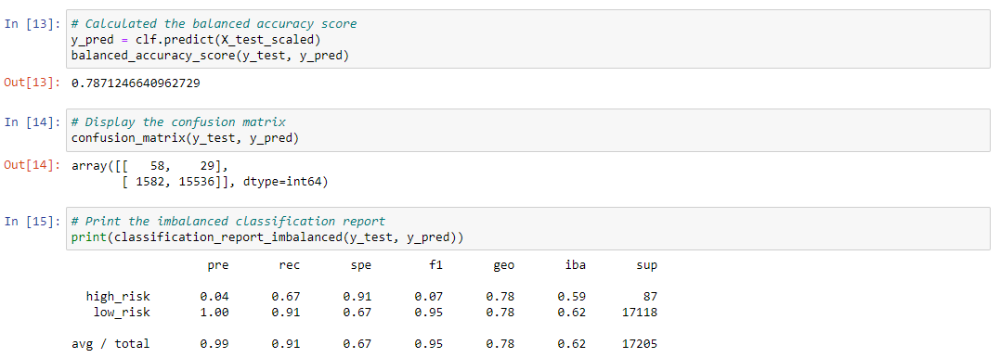
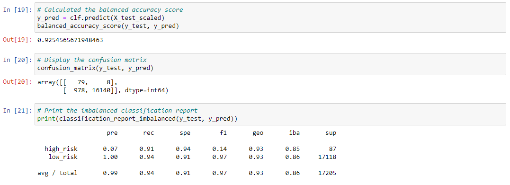

# Credit Risk Analysis
Columbia Bootcamp Supervised Machine Learning Module

## Random Number Generation
Some of the values for the analyses are slightly different from the starter-code snippets.  This is likely due to different versions of *sklearn* or *imblearn* using slightly different algorithms, despite the same random seed.  The values are still close enough to provide similar results.

## Deliverable #1
This deliverable requested the statistical results from three algorithms: RandomOverSampler, SMOTE, and ClusterCentroids.

| Algorithm | Accuracy Score | Confusion Matrix | Precision/Recall Table |
| --------- | -------------- | ---------------- | ---------------------- |
| RandomOverSampler | 0.666 | <table> <tbody> <tr><td></td><td>high_pr</td><td>low_pr</td></tr> <tr> <td>high</td> <td>57</td>  <td>30</td>  </tr>  <tr> <td>low</td> <td>5537</td>  <td>11581</td>  </tr>  </tbody>  </table> | <table>  <thead>  <tr>  <th></th>  <th>Precision</th>  <th>Recall</th>  </tr>  </thead>  <tbody>  <tr>  <td>high_risk</td>  <td>0.01</code></td>  <td>0.66</td>  </tr>  <tr>  <td>low_risk</td>  <td>1.00</td>  <td>0.68</td>  </tr>  </tbody>  </table> |
| SMOTE | 0.644 | <table> <tbody> <tr><td></td><td>high_pr</td><td>low_pr</td></tr> <tr> <td>high</td> <td>54</td>  <td>33</td>  </tr>  <tr> <td>low</td> <td>5691</td>  <td>11427</td>  </tr>  </tbody>  </table> | <table>  <thead>  <tr>  <th></th>  <th>Precision</th>  <th>Recall</th>  </tr>  </thead>  <tbody>  <tr>  <td>high_risk</td>  <td>0.01</code></td>  <td>0.62</td>  </tr>  <tr>  <td>low_risk</td>  <td>1.00</td>  <td>0.67</td>  </tr>  </tbody>  </table> |
| ClusterCentroids | 0.510 | <table> <tbody> <tr><td></td><td>high_pr</td><td>low_pr</td></tr> <tr> <td>high</td> <td>51</td>  <td>36</td>  </tr>  <tr> <td>low</td> <td>9681</td>  <td>7437</td>  </tr>  </tbody>  </table> | <table>  <thead>  <tr>  <th></th>  <th>Precision</th>  <th>Recall</th>  </tr>  </thead>  <tbody>  <tr>  <td>high_risk</td>  <td>0.01</code></td>  <td>0.59</td>  </tr>  <tr>  <td>low_risk</td>  <td>1.00</td>  <td>0.43</td>  </tr>  </tbody>  </table> |

### Screenshots:
#### RandomOverSampler

#### SMOTE

#### ClusterCentroids

## Deliverable #2
This deliverable requested the statistical results from one algorithm: SMOTEENN.

| Algorithm | Accuracy Score | Confusion Matrix | Precision/Recall Table |
| --------- | -------------- | ---------------- | ---------------------- |
| SMOTEENN | 0.638 | <table> <tbody> <tr><td></td><td>high_pr</td><td>low_pr</td></tr> <tr> <td>high</td> <td>57</td>  <td>30</td>  </tr>  <tr> <td>low</td> <td>5537</td>  <td>11581</td>  </tr>  </tbody>  </table> | <table>  <thead>  <tr>  <th></th>  <th>Precision</th>  <th>Recall</th>  </tr>  </thead>  <tbody>  <tr>  <td>high_risk</td>  <td>0.01</code></td>  <td>0.66</td>  </tr>  <tr>  <td>low_risk</td>  <td>1.00</td>  <td>0.68</td>  </tr>  </tbody>  </table> |

### Screenshot:
#### SMOTEENN

## Deliverable #3
This deliverable requested the statistical results from two algorithms: BalancedRandomForestClassifier and EasyEnsembleClassifier.

| Algorithm | Accuracy Score | Confusion Matrix | Precision/Recall Table |
| --------- | -------------- | ---------------- | ---------------------- |
| BalancedRandom ForestClassifier | 0.787 | <table> <tbody> <tr><td></td><td>high_pr</td><td>low_pr</td></tr> <tr> <td>high</td> <td>58</td>  <td>29</td>  </tr>  <tr> <td>low</td> <td>1582</td>  <td>15536</td>  </tr>  </tbody>  </table> | <table>  <thead>  <tr>  <th></th>  <th>Precision</th>  <th>Recall</th>  </tr>  </thead>  <tbody>  <tr>  <td>high_risk</td>  <td>0.04</code></td>  <td>0.67</td>  </tr>  <tr>  <td>low_risk</td>  <td>1.00</td>  <td>0.91</td>  </tr>  </tbody>  </table> |
| EasyEnsembleClassifier | 0.925 | <table> <tbody> <tr><td></td><td>high_pr</td><td>low_pr</td></tr> <tr> <td>high</td> <td>79</td>  <td>8</td>  </tr>  <tr> <td>low</td> <td>978</td>  <td>16140</td>  </tr>  </tbody>  </table> | <table>  <thead>  <tr>  <th></th>  <th>Precision</th>  <th>Recall</th>  </tr>  </thead>  <tbody>  <tr>  <td>high_risk</td>  <td>0.07</code></td>  <td>0.91</td>  </tr>  <tr>  <td>low_risk</td>  <td>1.00</td>  <td>0.94</td>  </tr>  </tbody>  </table> |

### Screenshots:
#### BalancedRandomForestClassifier

#### EasyEnsembleClassifier

## Deliverable #4

### Combined Table for All Six Algorithms

| Algorithm | Accuracy Score | Confusion Matrix | Precision/Recall Table |
| --------- | -------------- | ---------------- | ---------------------- |
| RandomOverSampler | 0.666 | <table> <tbody> <tr><td></td><td>high_pr</td><td>low_pr</td></tr> <tr> <td>high</td> <td>57</td>  <td>30</td>  </tr>  <tr> <td>low</td> <td>5537</td>  <td>11581</td>  </tr>  </tbody>  </table> | <table>  <thead>  <tr>  <th></th>  <th>Precision</th>  <th>Recall</th>  </tr>  </thead>  <tbody>  <tr>  <td>high_risk</td>  <td>0.01</code></td>  <td>0.66</td>  </tr>  <tr>  <td>low_risk</td>  <td>1.00</td>  <td>0.68</td>  </tr>  </tbody>  </table> |
| SMOTE | 0.644 | <table> <tbody> <tr><td></td><td>high_pr</td><td>low_pr</td></tr> <tr> <td>high</td> <td>54</td>  <td>33</td>  </tr>  <tr> <td>low</td> <td>5691</td>  <td>11427</td>  </tr>  </tbody>  </table> | <table>  <thead>  <tr>  <th></th>  <th>Precision</th>  <th>Recall</th>  </tr>  </thead>  <tbody>  <tr>  <td>high_risk</td>  <td>0.01</code></td>  <td>0.62</td>  </tr>  <tr>  <td>low_risk</td>  <td>1.00</td>  <td>0.67</td>  </tr>  </tbody>  </table> |
| ClusterCentroids | 0.510 | <table> <tbody> <tr><td></td><td>high_pr</td><td>low_pr</td></tr> <tr> <td>high</td> <td>51</td>  <td>36</td>  </tr>  <tr> <td>low</td> <td>9681</td>  <td>7437</td>  </tr>  </tbody>  </table> | <table>  <thead>  <tr>  <th></th>  <th>Precision</th>  <th>Recall</th>  </tr>  </thead>  <tbody>  <tr>  <td>high_risk</td>  <td>0.01</code></td>  <td>0.59</td>  </tr>  <tr>  <td>low_risk</td>  <td>1.00</td>  <td>0.43</td>  </tr>  </tbody>  </table> |
| SMOTEENN | 0.638 | <table> <tbody> <tr><td></td><td>high_pr</td><td>low_pr</td></tr> <tr> <td>high</td> <td>57</td>  <td>30</td>  </tr>  <tr> <td>low</td> <td>5537</td>  <td>11581</td>  </tr>  </tbody>  </table> | <table>  <thead>  <tr>  <th></th>  <th>Precision</th>  <th>Recall</th>  </tr>  </thead>  <tbody>  <tr>  <td>high_risk</td>  <td>0.01</code></td>  <td>0.66</td>  </tr>  <tr>  <td>low_risk</td>  <td>1.00</td>  <td>0.68</td>  </tr>  </tbody>  </table> |
| BalancedRandom ForestClassifier | 0.787 | <table> <tbody> <tr><td></td><td>high_pr</td><td>low_pr</td></tr> <tr> <td>high</td> <td>58</td>  <td>29</td>  </tr>  <tr> <td>low</td> <td>1582</td>  <td>15536</td>  </tr>  </tbody>  </table> | <table>  <thead>  <tr>  <th></th>  <th>Precision</th>  <th>Recall</th>  </tr>  </thead>  <tbody>  <tr>  <td>high_risk</td>  <td>0.04</code></td>  <td>0.67</td>  </tr>  <tr>  <td>low_risk</td>  <td>1.00</td>  <td>0.91</td>  </tr>  </tbody>  </table> |
| EasyEnsembleClassifier | 0.925 | <table> <tbody> <tr><td></td><td>high_pr</td><td>low_pr</td></tr> <tr> <td>high</td> <td>79</td>  <td>8</td>  </tr>  <tr> <td>low</td> <td>978</td>  <td>16140</td>  </tr>  </tbody>  </table> | <table>  <thead>  <tr>  <th></th>  <th>Precision</th>  <th>Recall</th>  </tr>  </thead>  <tbody>  <tr>  <td>high_risk</td>  <td>0.07</code></td>  <td>0.91</td>  </tr>  <tr>  <td>low_risk</td>  <td>1.00</td>  <td>0.94</td>  </tr>  </tbody>  </table> |

### Overview
The purpose of this analysis is to examine different machine learning algorithms to attempt to accurately predict whether a loan is a **low-risk** loan or a **high-risk** loan.  There are a large number of potential features that can help inform these predictions, some of which are strings and needed to be converted to numeric values via `pd.get_dummies()`.
- One important characteristic of this dataset is that there are significantly more **low-risk** loans than **high-risk** loans.  This will be important for different sampling methods.

### Algorithm Descriptions
#### RandomOverSampler
RandomOverSampler is a standard oversampling algorithm, choosing to oversample the minority population to balance out the numbers of each class.

#### SMOTE
Another oversampling algorithm, taking members of the minority population and "merging" them with nearby neighbors to form a new entry, and using that to bolster the minority sample numbers.

[SMOTE Tutorial](https://machinelearningmastery.com/smote-oversampling-for-imbalanced-classification/)
#### ClusterCentroids
ClusterCentroids is an undersampling algorithm that lessens the majority population by performing k-means clustering on the majority and selecting for values close to the centroids of the clusters.

#### SMOTEENN
SMOTEENN is a combined algorithm, which oversamples with SMOTE and then undersamples with ENN (edited nearest neighbors), which lowers the majority by removing sample values that are close to boundaries.

#### BalancedRandomForestClassifier
BalancedRandomForestClassifier is a random forest (ensemble) algorithm that balances each bootstrap sample by undersampling.  Random forest classifiers should always be used carefully, so as not to overfit to the data.

#### EasyEnsembleClassifier
EasyEnsembleClassifier is an ensemble classifier which uses multiple AdaBoost classifiers to sequentially focus on incorrect weights, over a series of undersampled bootstraps.

### Results
- The accuracy scores of the algorithms are fairly consistent by method.  Methods involving oversampling had accuracy scores of 66.6%, 64.4%, and 63.8%, while only undersampling had accuracy of only 51.0%.  The ensemble algorithms had much better success, with scores of 78.7% for RandomForest and a wonderful 92.5% with EasyEnsemble.
- None of the algorithms had good precision when it came to high-risk loans.  There was always a high number of false positives (low-risk loans predicted as high-risk) relative to a low number of actual high-risk loans.  Even the best performing algorithm, EasyEnsemble, had only 7% precision (`79 / (79 + 978)`).  Precision on the low-risk loans was much better, and the best algorithms were able to achieve > 99% precision, partly due to the large number of low-risk compared to high-risk loans.
- When it came to recall, a similar result to accuracy came out, where the oversampling algorithms were better than pure undersampling, and ensemble methods were superior.  Both ensemble methods had > 90% recall for low-risk loans, but EasyEnsemble had significantly better high-risk recall: 91% to 67%.

### Summary
Of all the methods, the clear winner is the **EasyEnsembleClassifier** algorithm.  It had all around superior results in each category.  The only category it still had poor results for is high-risk precision - there is a significant chance of high-risk-predicted loan actually being a low-risk loan.  However, it was far-and-away the best at recalling high-risk loans, with 91% of high-risk loans (`79 / (79 + 8)`) accurately marked as high-risk.  When it comes to a loan evaluation, it is much more important that high-risk loans be accurately marked as high-risk than avoiding false positives, so that superior recall makes **EasyEnsembleClassifier** the *only* reasonable choice.

Ideally, having a larger sample of high-risk loans would allow for more training and testing entries and reduce the impact of resampling, which *might* improve other methods, but likely the EasyEnsembleClassifier would be even better with more training.
